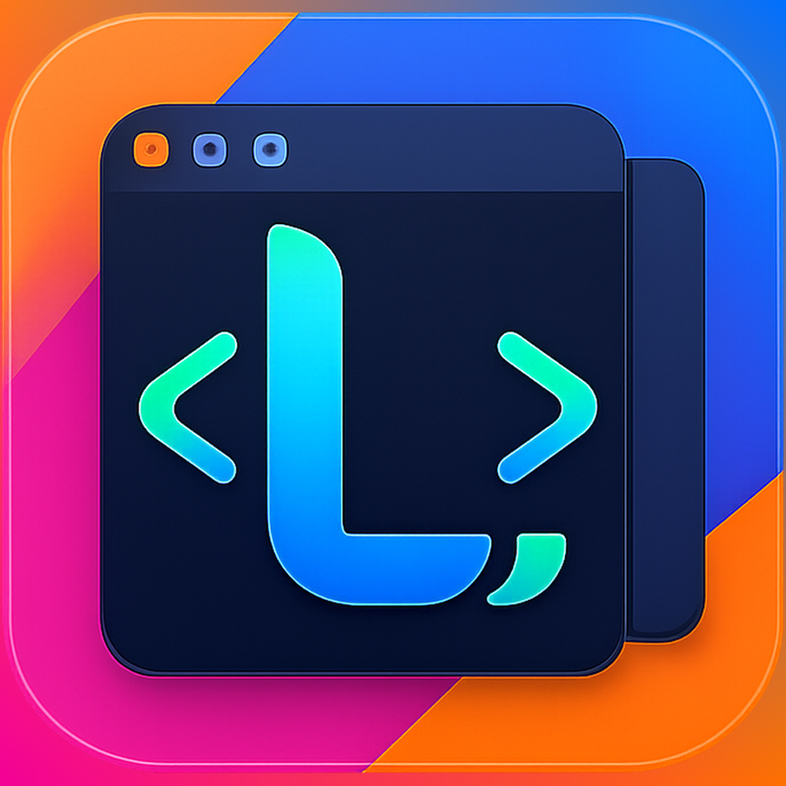
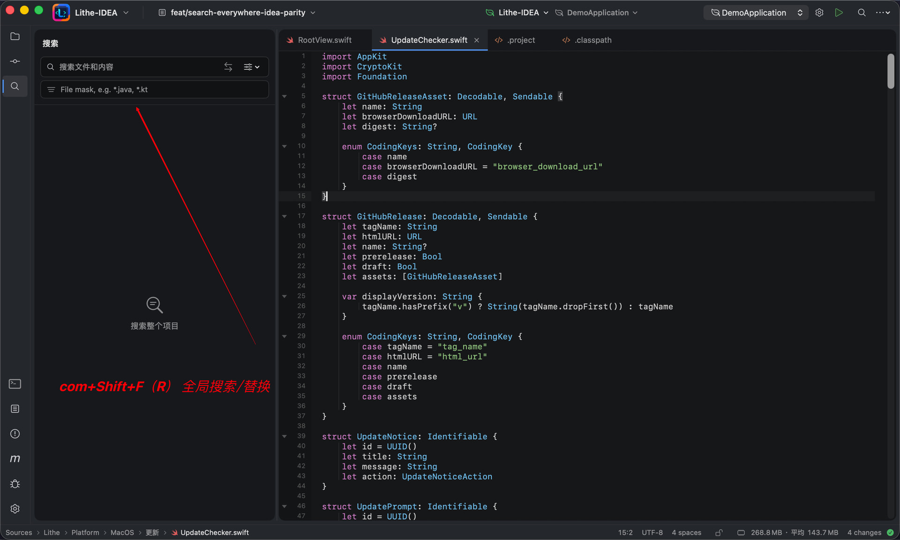
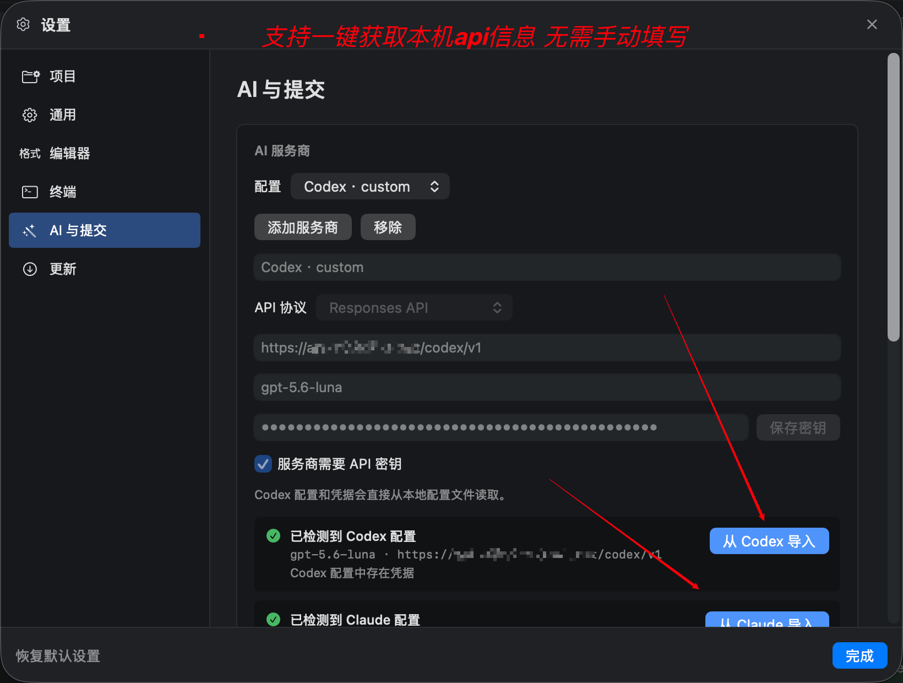
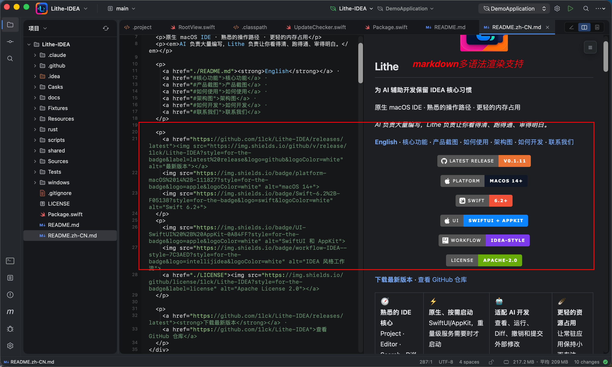
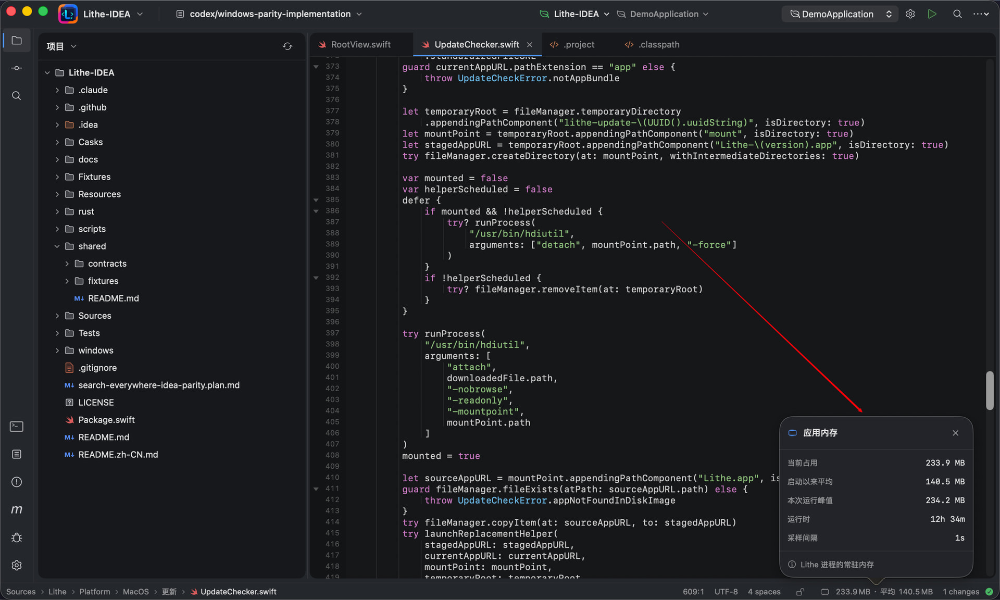
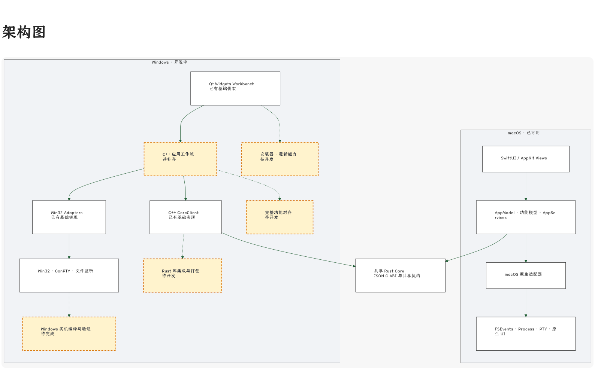
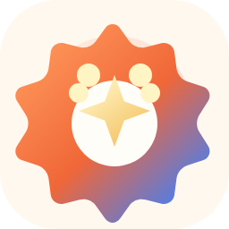

<div align="center">
  

  <h1>Lithe</h1>

  <p><strong>A cross-platform IDE for AI-assisted development</strong></p>
  <p>Familiar development workflows · multi-language project support · a focused resource footprint</p>
  <p><em>AI writes the code. Lithe helps you understand it, run it, and review it.</em></p>

  <p>
    <a href="./README.zh-CN.md"><strong>简体中文</strong></a> ·
    <a href="#core-features">Core features</a> ·
    <a href="#product-tour">Product tour</a> ·
    <a href="#use-lithe">Use Lithe</a> ·
    <a href="#architecture-overview">Architecture</a> ·
    <a href="#develop-lithe">Develop Lithe</a> ·
    <a href="#contact-us">Contact us</a>
  </p>

  <p>
    <a href="https://github.com/1lck/Lithe-IDEA/releases/latest"></a>
    
    
  </p>
  <p>
    
    
    <a href="./LICENSE"></a>
  </p>

  <p>
    <a href="https://github.com/1lck/Lithe-IDEA/releases/latest"><strong>Download the latest release</strong></a> ·
    <a href="https://github.com/1lck/Lithe-IDEA">View the repository</a>
  </p>
</div>

<table align="center">
  <tr>
    <td align="center">🧭<br><strong>General-purpose IDE</strong><br>Project · Editor · Search · Diff</td>
    <td align="center">⚡<br><strong>Performance focused</strong><br>Services start on demand to keep workflows responsive</td>
    <td align="center">🤖<br><strong>AI-ready review loop</strong><br>See, run, diff, undo, and commit external changes</td>
    <td align="center">🪶<br><strong>Lighter footprint</strong><br>Keep the resident app small and focused</td>
  </tr>
</table>

## About Lithe

Lithe is a high-performance, general-purpose IDE for AI-assisted development. It brings project browsing, editing, search, code navigation, Git, run, and debug workflows together for multi-language and multi-type projects, while starting language servers, terminals, build tools, and debug processes only when needed.

When an external AI tool changes a project, Lithe helps you locate the affected code, run the project, review the diff, and decide which changes to stage, undo, or commit.

> **A high-performance general-purpose IDE for modern development.**

## Core features

1. Built for Spring Boot projects and Java development.
2. Maven management, breakpoint debugging, and custom run configurations.
3. Git management and side-by-side diff review.
4. Double-Shift search and `Command + Shift + F` project-wide search.
5. Process-free lightweight completion and current-file navigation, with on-demand language servers for richer completion, hover, and semantic navigation.
6. Local snapshot history.
7. Multiple projects open within the app.
8. Multiple files open independently in the same window.
9. AI-generated commit messages with customizable formats.
10. Rich Markdown rendering consistent with Yuque syntax.
11. Local application memory usage monitoring.
12. One-command installation and updates through Homebrew.
13. One-click in-app updates and installation.
14. Automatic project entry-point detection with one-click run support for Spring Boot, Java, Maven, Gradle, npm, Cargo, Go, Python, Make, Docker Compose, Procfile, and shell projects.
15. Per-language service switches so language servers can be enabled or disabled independently to match the machine's resources.
16. Multi-line editor tabs for keeping more files visible in the same workspace.
17. Database connection workspace with multiple database types, connection management, SQL history, table browsing, and database operations.
18. Ongoing bug fixes and user experience improvements.

## Product tour

<p align="center">
  
  
</p>

<p align="center">
  
</p>

<p align="center">
  
  
</p>

<p align="center">
  
</p>

<p align="center">
  
  
</p>

<p align="center">
  
  
</p>

<p align="center">
  
</p>

<p align="center">
  
  
</p>

<p align="center">
  
  
</p>

## Use Lithe

Lithe requires macOS 13 or later. Java project features require a JDK; JDK 17 or JDK 21 is recommended. Maven projects need either a project `mvnw` or a system Maven installation. Lightweight completion does not start an external process; when a matching language server is installed, Lithe routes the capabilities it actually advertises through the shared Rust LSP Core. See the [language tooling and LSP architecture](./docs/architecture/language-tooling.md) for provider configuration and compatibility details.

Download the latest macOS `.dmg` from [GitHub Releases](https://github.com/1lck/Lithe-IDEA/releases/latest). If a release provides architecture-specific installers, choose `arm64` for Apple silicon or `x86_64` for an Intel Mac. Open the disk image, drag `Lithe.app` into `/Applications`, and launch it.

Install Lithe with the project Homebrew tap. The tap verifies the release checksum and clears the macOS quarantine attribute after installation:

```bash
brew tap 1lck/lithe https://github.com/1lck/Lithe-IDEA.git
brew install --cask 1lck/lithe/lithe
```

Update it with:

```bash
brew update
brew upgrade --cask lithe
```

If macOS blocks an app from an unidentified developer, right-click the app and select **Open**, or go to **System Settings → Privacy & Security → Open Anyway**. Only after confirming that the app came from an official Lithe GitHub Release, you can also run:

```bash
xattr -dr com.apple.quarantine "/Applications/Lithe.app"
open "/Applications/Lithe.app"
```

After opening a project, use **Settings → Project** to configure the project JDK, Maven, and the JDK used by Maven. Lithe also detects Java and Maven from common system locations.

### Database workspace and external MCP

The optional Database workspace supports MySQL, MariaDB, PostgreSQL, SQLite,
Microsoft SQL Server, MongoDB, Redis, and Nacos through an on-demand Rust helper.
The helper is not started while the database workspace is unused. SQL connections provide table CRUD, TSV batch paste,
find/replace within the current page, plus CSV, JSON, and SQL import and export.
MariaDB reuses the MySQL-compatible engine; SQL Server has a native TDS data-grid
adapter. MongoDB collections use the document grid with paging, filters, indexes,
and protected insert/update/delete operations.
Redis uses incremental `SCAN` pages instead of loading an entire keyspace, and its
first workspace supports String and Hash editing, TTL changes, key renaming, and
deletion. Nacos provides configuration search and publishing, plus service and
instance health views. Redis and Nacos writes follow the same read-only and
production-protection rules as SQL writes. SQL backups are complete by default,
without a per-table row limit. Restoring a SQL backup always requires confirmation,
verifies the backup before changing the target, and then replaces the current
database objects and data. Release bundles also include
`Contents/Helpers/lithe-db-mcp`, an independent MCP stdio adapter for external
automation. It provides database tools only; Lithe does not include an in-app
natural-language Agent conversation.

For upstream audit, `third_party/dbx` contains a source-only snapshot of
[t8y2/dbx](https://github.com/t8y2/dbx) at commit
[`996ce42e80387bba4b33a2bf1713f590ef79d476`](https://github.com/t8y2/dbx/commit/996ce42e80387bba4b33a2bf1713f590ef79d476).
It is not a Git submodule or runtime dependency and is excluded from Lithe's
release bundle; the database helper is implemented and built independently.
The eight database brand marks used by the current workspace are copied into
`Resources/DatabaseIcons` as independent application resources. Their DBX
source, Apache-2.0 license, and trademark-use notice are recorded alongside
the files, so the packaged application never resolves assets from `third_party`.

## Architecture Overview

The macOS and Windows implementations are feature-complete. The Windows build is currently in pre-release validation and has not been published yet.

<p align="center">
  
</p>

## Develop Lithe

Development requires Swift 6.2 or later. Running the complete test suite requires Xcode; basic SwiftPM builds only need Command Line Tools.

Run the development build from the repository root:

```bash
./scripts/preview.sh
```

The script builds and links Rust Core before launching the macOS app. To validate only the Swift source, run:

```bash
swift run --disable-sandbox Lithe
```

Build an app bundle:

```bash
./scripts/package-app.sh
open dist/Lithe.app
```

Before submitting a change, run:

```bash
./scripts/test-macos.sh
./scripts/verify-core.sh
./scripts/verify-git-graph.sh
./scripts/verify-service-boundaries.sh
./scripts/verify-shared-contracts.sh
./scripts/verify-windows-boundaries.sh
./scripts/verify-rust-core.sh
```

See [Repository layout and shared boundaries](./docs/architecture/repository-layout.md) for directory ownership, cross-platform boundaries, and sharing rules. Include your verification steps and known limitations when submitting a change.

## Project support

### ❤️ Sponsors

<table>
  <tr>
    <td width="112" align="center">
      <a href="https://www.fastaitoken.com/">
        
      </a>
    </td>
    <td>
      <a href="https://www.fastaitoken.com/"><strong>FastAI</strong></a> provides access to large language models and supports the development of Lithe. Thank you to FastAI for supporting this project!
    </td>
  </tr>
  <tr>
    <td width="112" align="center">
      <a href="https://codezsy.com">
        
      </a>
    </td>
    <td>
      <a href="https://codezsy.com"><strong>CodeZ</strong></a> provides relay access to GPT-family models and supports the development of Lithe. Thank you to CodeZ for supporting this project!
    </td>
  </tr>
  <tr>
    <td width="112" align="center">
      <a href="https://shu26.cfd/">
        
      </a>
    </td>
    <td>
      <a href="https://shu26.cfd/"><strong>Code GO</strong></a> provides relay access to Claude models and supports the development of Lithe. Thank you to Code GO for supporting this project!
    </td>
  </tr>
</table>

### ⭐ Special thanks

<p align="center">
  <a href="https://linux.do/">
    
  </a>
</p>

<p align="center">
  <strong>For all things AI, head to LINUX DO. Wishing the community ever greater success.</strong>
</p>

### Contributors

Thank you to everyone who contributes to and improves Lithe.

<a href="https://github.com/1lck/Lithe-IDEA/graphs/contributors">
  
</a>

### License

Lithe is licensed under the [Apache License 2.0](./LICENSE).

## Star History

Each point shows the repository's cumulative Star count at `00:00` Beijing time on that date. The chart starts at zero on August 2, 2026.

<a href="https://www.star-history.com/#1lck/Lithe-IDEA&Date">
  
</a>

## Contact us

Join the Lithe-IDEA community group to discuss the project and share feedback, or contact the author directly.

<table align="center">
  <tr>
    <td align="center"><strong>Join the community group</strong></td>
    <td align="center"><strong>Contact the author</strong></td>
  </tr>
  <tr>
    <td align="center"></td>
    <td align="center"></td>
  </tr>
</table>
